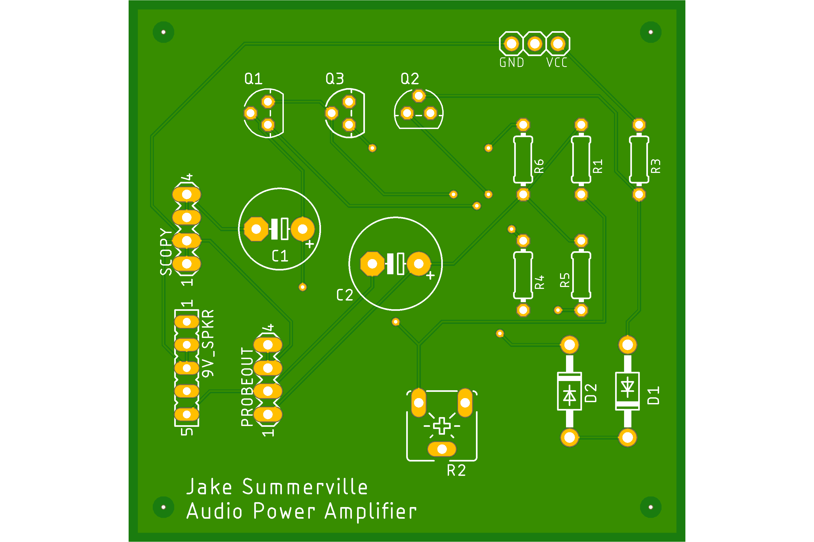

# Power Amplifier Circuit Design 

## Simulation

Simulation was performed using OrCAD's PSpice software. 

## Eagle

PCB design schematic created using Autodesk's Eagle software 

Adafruit extension was used to create certain packages. Adafruit install instructions can be found [here](https://www.autodesk.com/products/eagle/blog/library-basics-install-use-sparkfun-adafruit-libraries-autodesk-eagle/)

## PCB Design

### PCB Top

  

### PCB Bottom

  

## Author

- Jake Summerville